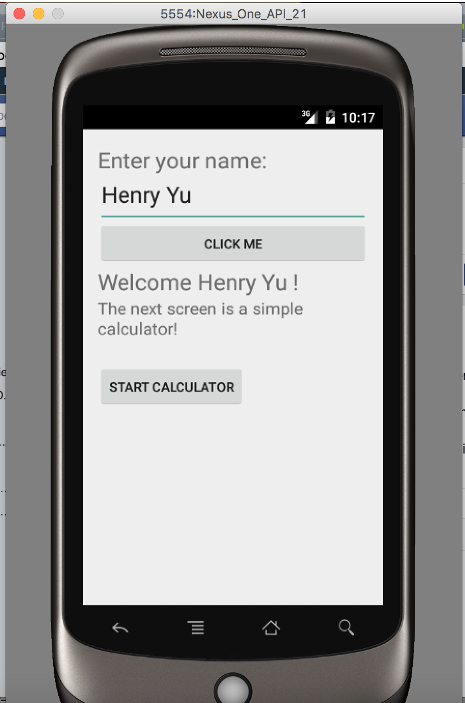

# android-quiz

Hello! This is the beginning of a new Legacy Project for CS56 at the University of California, Santa Barbara.

Project Description: An Android Application.

Authors: Henry Yu, Phillip Fry Date: Winter 2016

Professor: Phil Conrad
Mentor: Allie Shedden

Progress and Point Breakdown:

Downloaded Android Studio. Familiarized with Java files vs. XML files.

Configured Android Manifest file. Familiarized with Layouts, Listeners, Widgets, etc.

Created 3 Activities: 
  
  1) Welcome Screen in which it prompts the user to enter their name. After pressing enter, their name will show up as a welcome message. There is a button that directs the user to the next screen.
  
  2) Calculator Screen in which it is a simple calculator application with Addition, Subtraction, Multiplication, Division. There is a button that directs the user to the next screen.
  
  3) Quiz Screen in which the the user is prompted with a conversion quiz between binary and decimal (In Progress).
  

