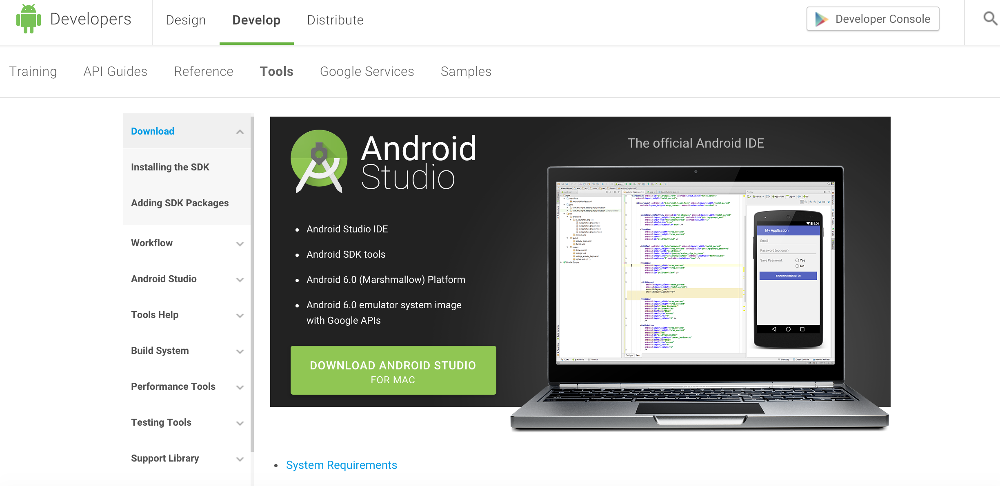
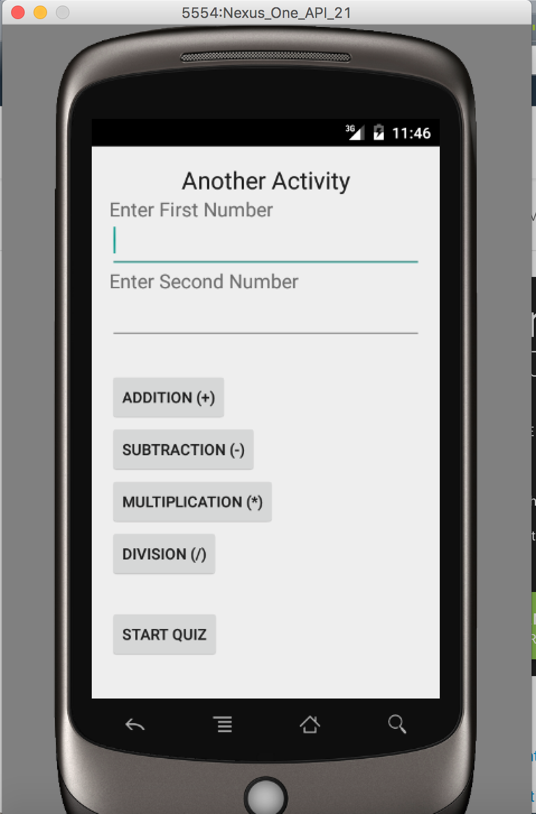
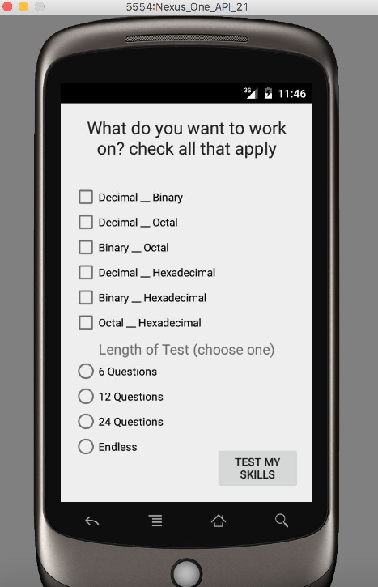
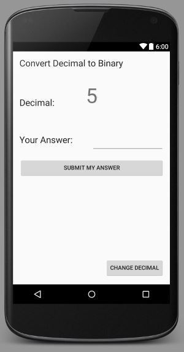

# cs56-android-quiz

## Project History

| Details      | -              | -                  |
| -------------|----------------|--------------------|
| Creators     | Henry Yu       | Phillip Fry        |
| Instructors  | Phillip Conrad | Allison Shedded    |
| Winter 2016  | CS 56          | UCSB               |

## What is This?

This is a "made from scratch" Android Application built with Android Studio. It contains a simple calculator followed by a selection of number conversion quizzes. This is a legacy code project for an undergraduate computer science course at the University of California, Santa Barbara. The project stems from an already existing project written in Java: https://github.com/UCSB-CS56-Projects/cs56-math-conversion-quiz

## How to Run?

Download the lastest version of Android Studio at the following link: http://developer.android.com/sdk/index.html. Git clone this repository and open the project folder inside Android Studio and running it should be smooth. Make sure you have the latest SDK installed and updated.

## How does the Application Work?

Run the app by clicking Run on Android Studio. Choose any Android Device as your emulator and the application should start. You will be prompted with a welcome screen, after which you are invited to type in your name and a welcome message will be displayed. Next screen is a simple calculator you can play around with. Following is the quiz itself, which contains checkboxes for the types of conversions (ie. Decimal to Binary or Octal to Hexadecimal) and radio buttons for the length of the quiz (ie. 6 questions, 12 questions, etc.) You will then be prompted with the quiz interface itself, where a number is given and the user will be prompted to type in the correct conversion. A "Change Number" feature is added if the current problem is too difficult. A "Percentage" feature has also been implemented to tell the user how well they are doing as they are progressing throughout the quiz. 

## Screenshots

@TODO
Screenshots of the running Application goes here.

## Legacy Code Issues

@TODO
Will be present in the "Issues" tab of this repository. https://github.com/henryhyu/android-quiz/issues

## Project Point Distribution

| Points       | Topic                                                          | Driver/Nagivator |
| -------------|----------------------------------------------------------------|------------------|
|  150         |  README.md                                                     | H.Y./P.F.        |
|  100         |  Learning Android                                              | H.Y./P.F.        |
|  50          |  Intro Screen (2nd Activity)                                   | H.Y./P.F.        |
|  100         |  Calculator                                                    | H.Y./P.F.        |
|  150         |  (Inital) Binary to Decimal Conversion                         | P.F./H.Y.        |
|  100         |  Decimal to Octal Conversion                                   | P.F./H.Y.        |
|  100         |  Binary to Octal Conversion                                    | P.F./H.Y.        |
|  100         |  Decimal to Hexadecimal Conversion                             | P.F./H.Y.        |
|  100         |  Graphical Intro Screen                                        | P.F./H.Y.        |
|  100         |  Basic App Logic/Structure (Quality Assurance stuff)           | H.Y./P.F.        |
|  50          |  Transparency for the written code via Comments                | P.F./H.Y.        |
|  25          |  Leaving legacy code for next generation of students           | H.Y./P.F.        |
| Total        |  1125 Points                                                   | -                |

Learning Android Explanation: Beginning the app/learning how android studio works in regards to activities/manifest/xml

Basic App Logic/Structure Explanation: ie. Making sure text boxes are not empty, check boxes are checked, radio buttons are clicked. Making sure buttons go to the right activity, error handling, etc. making sure works on multiple android devices, etc.

## Lab 07 (Pre 500 Points README.md Old)
Progress and Point Breakdown:

Downloaded Android Studio. Familiarized with Java files vs. XML files.

Configured Android Manifest file. Familiarized with Layouts, Listeners, Widgets, etc.

Created 3 Activities:

1) Welcome Screen in which it prompts the user to enter their name. After pressing enter, their name will show up as a welcome message. There is a button that directs the user to the next screen.

2) Calculator Screen in which it is a simple calculator application with Addition, Subtraction, Multiplication, Division. There is a button that directs the user to the next screen.

3) Quiz Intro Screen that prompts the user for what they would like to be quizzed on. We still need to figure out how to make sure the display looks the same on different devices. On smaller screen simulators there is some overlap in the text. It works on an andorid device properly (HTC ONE M8).

4) Quiz Activity which tests the users knowledge of numeric conversions (still in progress, only does Decimal to Binary)
